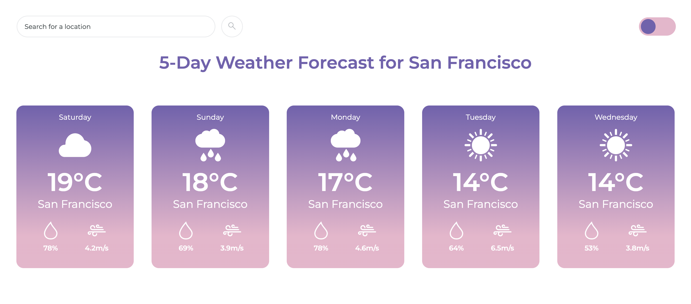
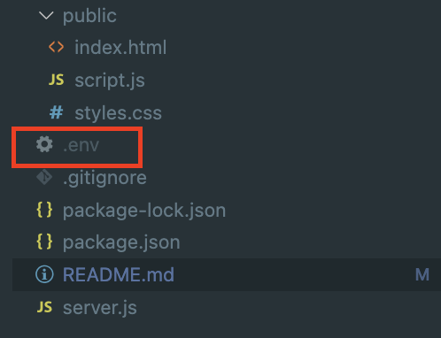

# Weather App
#### Video Demo:  <https://youtu.be/4E56A7DA-Ow>
#### Description:
Welcome to **Weather App**! A simple weather application that retrieves a five-day weather forecast for any location worldwide using the OpenWeatherMap API. This app was designed and implemented by me as part of CS50x 2023. 



## Build
**Prerequisites**<br>
 - _[Node.js and NPM](https://nodejs.org/en) must be installed_
 - This app relies on the OpenWeatherMap API. Create a free account with [OpenWeatherMap](https://home.openweathermap.org/users/sign_up) to generate an API key.

**Installation**<br>
1. Run `npm install` in the project root to install dependencies. 
2. Create an .env file in your project.



3. In the .env file, follow the format below to name your API key, matching the variable used in `server.js`. Remember to substitute the placeholder with your actual key value!

```
API_KEY="abcdefg1234567"
```

**Run the Application**

Run `node server.js` to start the application. You can then view the app by opening http://localhost:3000 in your browser!

## Features
 - This application is pretty straightforward. Users can search for weather information by typing the location and either clicking the search button or simply pressing the 'Enter' key. The app then provides a five-day weather forecast, featuring a weather icon symbolizing the conditions for each day, along with temperature, humidity, and wind speed data
 - Additionally, users can easily switch between dark and light mode.
 - In case users input an invalid location, an error message will appear to guide them.

 **Possible Improvements**

All applications can be improved. Here are a few suggestions for this one; 
 - Utilize the Geolocation API to display weather data based on the user's current location
 - Allowing users to select the number of days for the forecast, such as 3 days or 7 days

## Implementation

- The application is built with a server-side component represented by the `server.js` file. To power the backend, I've chosen to use **Node.js** along with **Express**. Node.js is known for its efficiency in handling asynchronous tasks, making it a good choice for server-side applications. Express is built on top of Node.js and simplifies the creation of web servers and APIs. This combination offers a smooth and efficient way to manage HTTP requests and responses. 
- For performing HTTP requests, I'm using **Axios**, which is a promise-based HTTP client for Node.js. 
- To enhance security, the API key is securely stored in a separate `.env` file. The key is accessed using the `dotenv` npm module, which allows me to keep sensitive information away from the rest of the code. 
- Within the backend, I've created an endpoint called **getWeatherData**. This endpoint is responsible for fetching weather data from the OpenWeatherMap API (One Call API 2.5). 
- Once data is obtained from the OpenWeatherMap API and is sent to **getWeatherData**, this data is then sent to the frontend where `script.js` retrieves and displays the data. 
- The frontend of this application is built using pure HTML, CSS, and JavaScript, and consists of three files, `index.html`, `styles.css` and `script.js`.


## Credit
 - Toggle button is from [uiverse.io](https://uiverse.io/AbanoubMagdy1/fluffy-octopus-90). I made additional customizations to make it work for my application. 
 - Weather icons are from [https://flaticons.net/](https://flaticons.net/)

